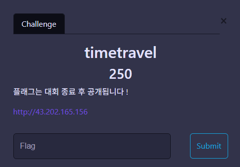
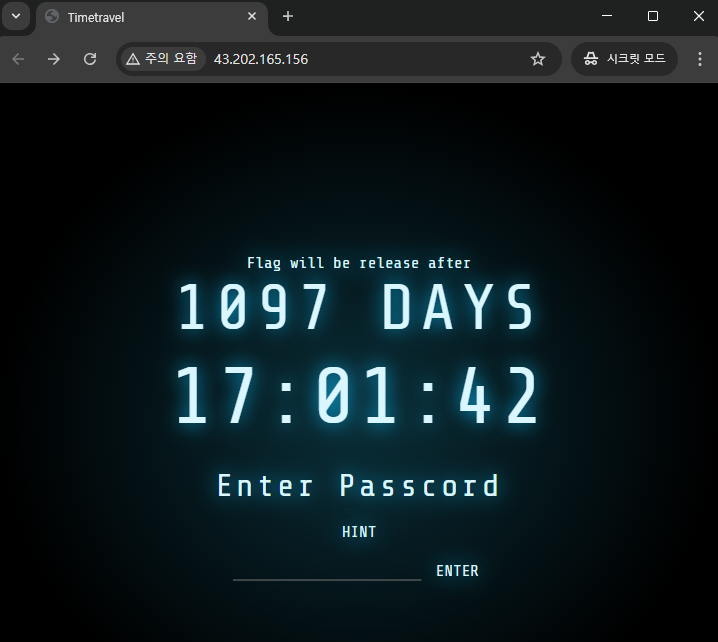
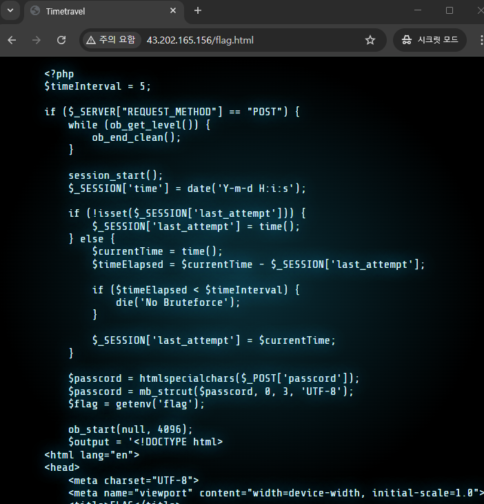
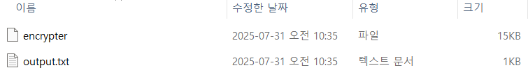
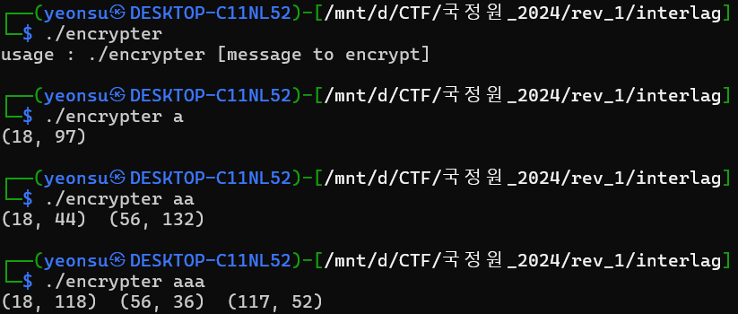
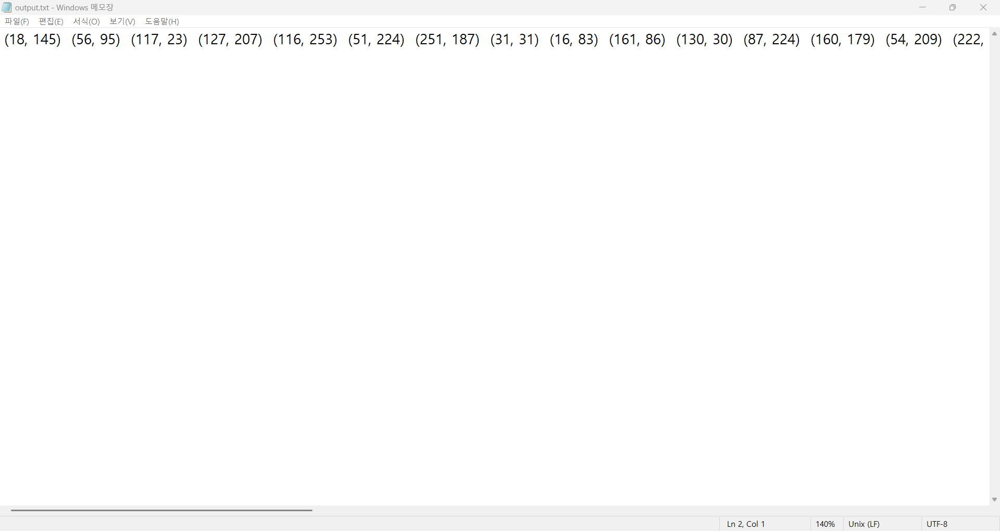
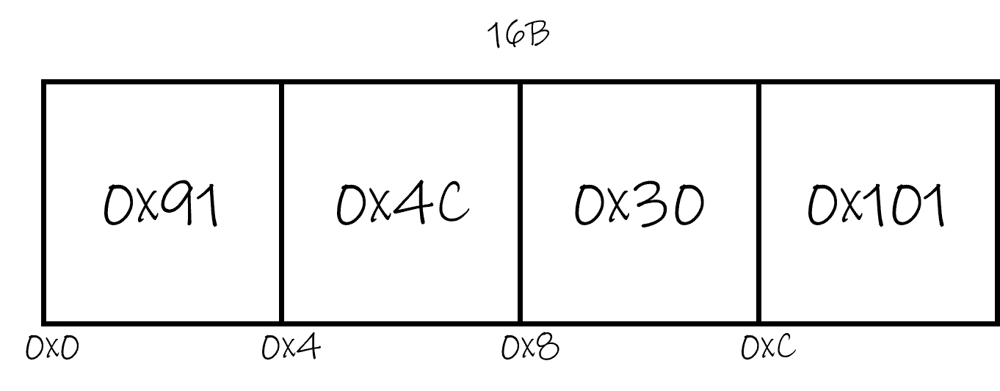
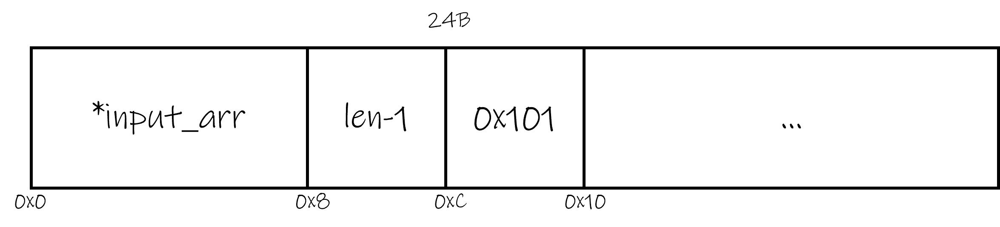
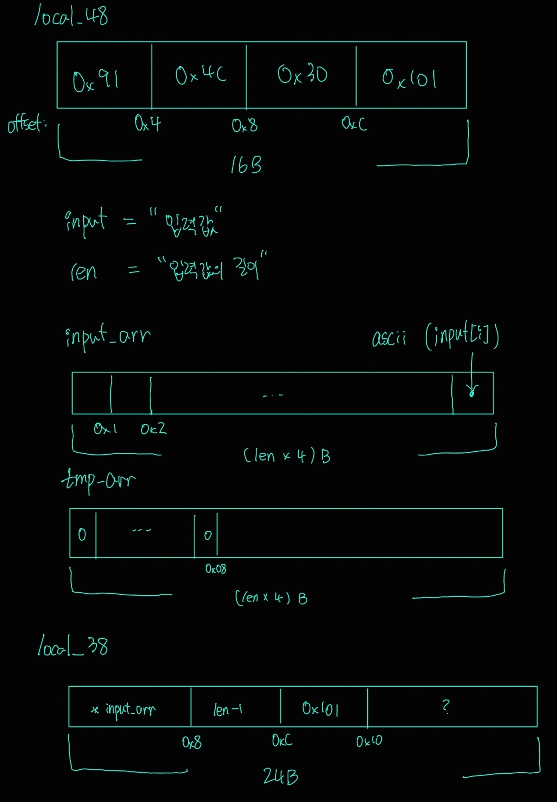

<!-- html-proofer-ignore-file -->
<script async id="MathJax-script" src="https://cdn.jsdelivr.net/npm/mathjax@3/es5/tex-mml-chtml.js"></script>

## **WEB/timetravel**
<figure style="text-align:center;">
  
  <figcaption>CHANLLENGE</figcaption>
</figure>

### RECON

주어진 링크로 들어가면 간단한 두 페이지를 확인할 수 있다. 입력을 할 수 있는 페이지와 힌트를 주는 페이지이다. 

<table style="width:100%;">
    <tr>
        <td style="width:50%;">
            <figure>
                
                <figcaption style="text-align:center;">INPUT PAGE</figcaption>
            </figure>
        </td>
        <td style="width:50%;">
            <figure>
                
                <figcaption style="text-align:center;">HINT PAGE</figcaption>
            </figure>
        </td>
    </tr>
</table>

```php
<?php
$timeInterval = 5;

if ($_SERVER["REQUEST_METHOD"] == "POST") {
    # (중략)

    $passcord = htmlspecialchars($_POST['passcord']);
    $passcord = mb_strcut($passcord, 0, 3, 'UTF-8');    # 숨겨진(?) 조건: 최대 3자리 입력만 허용
    $flag = getenv('flag');

    # (중략)

    try {
        $passcord = safe_iconv("UTF-8", "ISO-2022-CN-EXT", $passcord);
    } catch (Exception $e) {
        header("location:index.html");
        echo "redirected";
        exit();
    } finally {
        # 메인 로직
        # 목표: FLAG 획득을 위해 exit 되지 않게 조건에 부합하는 passcord 찾기
        $passcord = iconv("UTF-8", "ISO-2022-CN-EXT", $passcord);               # UTF-8 -> ISO-2022-CN-EXT
        $passcord_hex = bin2hex($passcord);                                     # 16진수로 변환
        error_log("Passcord: " . $passcord_hex);
        if (strlen($passcord_hex) >= 8) {                                       # 조건1: HEX로 8자리 이상임
            $fourth_byte_hex = substr($passcord_hex, 6, 2);
            $fourth_byte_value = hexdec($fourth_byte_hex);

            if ($fourth_byte_value >= 0x48 && $fourth_byte_value <= 0x4C) {     # 조건2: 특정 범위(72< ?? <76) 이내에 값이 존재
                header("location:index.html");
                echo "redirected";
                exit();
            } else {
                error_log("OK");
            }
        } else {
            header("location:index.html");
            echo "redirected";
            exit();
        }
        
    }

    # FLAG 획득
    $newoutput = str_replace("{{ passcord }}", $passcord, $output);
    $newoutput = str_replace("{{ flag }}", $flag, $newoutput);

    echo $newoutput;
}
?>          
```

### 풀이

<details>
  <summary><b>Flag 획득 조건</b></summary>
  <table style="border-collapse:collapse;width:100%;text-align:center;">
    <thead>
      <tr style="background-color:black;">
        <th style="border:1px solid #aaa;padding:8px;">조건 (about. passcord)</th>
        <th style="border:1px solid #aaa;padding:8px;">설명</th>
      </tr>
    </thead>
    <tbody>
      <tr>
        <td style="border:1px solid #aaa;padding:8px;">길이</td>
        <td style="border:1px solid #aaa;padding:8px;">8 바이트 이상</td>
      </tr>
      <tr>
        <td style="border:1px solid #aaa;padding:8px;">특정 위치의 값</td>
        <td style="border:1px solid #aaa;padding:8px;">passcord[6:7]값이 72~76 밖</td>
      </tr>
      <tr>
        <td style="border:1px solid #aaa;padding:8px;">인코딩 변화</td>
        <td style="border:1px solid #aaa;padding:8px;">길이 증가</td>
      </tr>
    </tbody>
  </table>
</details><br>

힌트로 주어진 소스코드를 분석하면, 45~46번 줄에서 플래그가 설정되어 *"$newoutput"*으로 출력된다는 것을 알 수 있다.

46번 줄이 실행이 되려면, exit로 흐르는 조건들을 피하는 입력값(passcord)을 넣어줘야 한다. (**플래그 획득 조건**에 정리해뒀다.) 

3자리 문자열(UTF-8)이 8자리 이상 문자열(ISO-2022-CN-EXT)으로 변화하려면, 어떤 입력이 필요할까? ISO-2022-CN-EXT은 중국어에 대한 문자열 인코딩 방식이다.(참고: [RFC-1922](https://datatracker.ietf.org/doc/html/rfc1922)) 갑자기 중국어라니, 아무래도 입력값이 중국어로 되어있어야 할 것 같다는 인상을 강하게 어필한다.

fourth_byte_hex가 특정 범위(72~76) 밖에 존재해야 플래그를 획득할 수 있는데, 이 조건은 fourth_byte_hex가 2바이트 값이기 때문에, 범위 안에 존재하는 것이 더 어렵다. 따라서 이 조건은 따로 고려하지 않고 일단 무작정 한자부터 입력해봤다.

韓國을 입력해보니, 플래그를 획득할 수 있었다.

![timetravel_result]

[timetravel_entry]: ../assets/CTF/CCE2024/timetravel/challenge.png
[timetravel_recon_1]: ../assets/CTF/CCE2024/timetravel/recon_1.png
[timetravel_recon_2]: ../assets/CTF/CCE2024/timetravel/recon_2.png
[timetravel_result]: ../assets/CTF/CCE2024/timetravel/result.png

## **REV/interlag**
<figure style="text-align:center;">
  
  <figcaption>Files</figcaption>
</figure>

### 탐색
문제에서 주어진 파일은 2개이다.
하나는 ELF 포멧의 실행파일(encrypter)이고, 다른 하나는 출력 결과 파일이다.<br>
encrypter를 실행하면 입력값을 요구하는 것을 확인할 수 있으며, 이는 OUTPUT.txt 파일의 순서쌍 형태로 암호화됨을 확인할 수 있다.
이때, 암호화는 문자열의 값과 길이에 따라 변하는 것을 확인할 수 있다.<br>

output.txt는 총 47개의 순서쌍으로 이루어져 있다. 순서쌍의 제1성분은 입력과 상관없이 고정되어 있고, 제2성분은 입력의 값과 길이에 따라 변한다는 점을 확인할 수 있다.

<table style="width:100%;">
    <tr>
        <td style="width:50%;">
            <figure>
                
                <figcaption style="text-align:center;">ENCRYPTER(ELF FORMAT)</figcaption>
            </figure>
        </td>
        <td style="width:50%;">
            <figure>
                
                <figcaption style="text-align:center;">OUTPUT.TXT</figcaption>
            </figure>
        </td>
    </tr>
</table>

따라서 플래그는 암호화된 output.txt의 값을 복호화해서 얻을 수 있다고 유추할 수 있다.

### 풀이
기드라를 통해 정적 분석을 진행한다. 식별된 메인 진입점은 다음과 같다.<br>
#### MAIN
```c 
    func_1(local_48,0x91,0x4c,0x30,0x101);                          /** 첫 번쨰 함수 ( local_48 할당 ) **/
    input = (char *)param_2[1];
    sVar2 = strlen(input);                                          // 주요 변수들 초기화
    input_len = (int)sVar2;
    ascii_arr = malloc((long)input_len << 2);
    tmp_arr = malloc((long)input_len << 2);
    memset(tmp_arr,0,8);
    for (i = 0; i < input_len; i = i + 1) {                         // ascii_arr에 입력 넣기
      *(int *)((long)ascii_arr + (long)i * 4) = (int)input[i];
    }
    func_2(local_38,ascii_arr,input_len + -1,0x101);                /** 두 번쨰 함수 ( local_38 할당 ) **/
    for (i = 0; i < input_len; i = i + 1) {                         // 순서쌍 출력을 위한 반복문
      do {
        value = func_3(local_48,1,0x101);                           /** 세 번째 함수 ( value 계산 ) **/
        flag = func_4(value,tmp_arr);                               /** 네 번째 함수 ( ??? ) **/
      } while (flag != '\0');
      *(int *)((long)i * 4 + (long)tmp_arr) = value;
      poVar1 = std::operator<<((ostream *)std::cout,"(");           // 순서쌍 출력 포멧
      poVar1 = (ostream *)std::ostream::operator<<(poVar1,value);   // (value, func_5(local_38, value))
      poVar1 = std::operator<<(poVar1,", ");
      value = func_5(local_38,value);                               /** 다섯 번째 함수 ( new_value 계산 ) **/
      poVar1 = (ostream *)std::ostream::operator<<(poVar1,value);
      std::operator<<(poVar1,")  ");
    }
    std::ostream::operator<<((ostream *)std::cout,std::endl<>);
```

총 5개의 주요한 기능을 하는 함수가 존재했고, 순서쌍을 계산하는 로직은 func_3과 func_5였다.

추가적인 설명은 각각의 함수에 대한 코드를 보면서 진행한다.

#### FUNC_1
``` c 
void func_1(undefined4 *param_1,undefined4 param_2,undefined4 param_3,undefined4 param_4,
        undefined4 param_5)
{
    *param_1 = param_2;
    param_1[1] = param_3;
    param_1[2] = param_4;
    param_1[3] = param_5;
    return;
}

// 실제 사용
func_1(local_48,0x91,0x4c,0x30,0x101);
```

local_48 구조체(배열)를 그림과 같이 초기화하는 함수이다.
<figure style="text-align:center;">
  
  <figcaption>local_48</figcaption>
</figure>

#### FUNC_2
``` c 
void func_2(long *param_1,long param_2,undefined4 param_3,undefined4 param_4)
{
    void *arr;
    int i;

    *(undefined4 *)(param_1 + 1) = param_3;
    arr = malloc((long)((int)param_1[1] + 1) << 2);
    *param_1 = (long)arr;
    for (i = 0; i <= (int)param_1[1]; i = i + 1) {
        *(undefined4 *)(*param_1 + (long)i * 4) = *(undefined4 *)((long)i * 4 + param_2);
    }
    *(undefined4 *)((long)param_1 + 0xc) = param_4;
    return;
}

// 실제 사용
func_2(local_38,ascii_arr,input_len + -1,0x101);
```

local_38 구조체(배열)를 그림과 같이 초기화하는 함수이다.
<figure style="text-align:center;">
  
  <figcaption>local_38</figcaption>
</figure>

1~11번 라인에서 초기화된 변수들을 시각화하면 다음과 같다.
<figure style="text-align:center;">
  
  <figcaption>main_variables</figcaption>
</figure>

#### FUNC_3
``` c 
ulong func_3(long param_1,int param_2,int param_3)
{
  int iVar1;
  undefined4 local_10;
  undefined4 i;
  
  local_10 = FUN_001013fa(param_1);
  if (*(int *)(param_1 + 0xc) < param_3) {              // 항상 성립하지 않음
    i = 0;
    while( true ) {
      if (param_3 / *(int *)(param_1 + 0xc) < i) break;
      iVar1 = FUN_001013fa(param_1);
      local_10 = local_10 + iVar1;
      i = i + 1;
    }
  }
  return (long)(param_2 + local_10) % (long)param_3 & 0xffffffff;
}

int FUN_001013fa(int *param_1)
{
  *param_1 = (param_1[1] * *param_1 + param_1[2]) % param_1[3];
  return *param_1;
}

// 실제 사용
value = func_3(local_48,1,0x101);
```

순서쌍의 제1성분에 들어갈 값을 계산하는 로직이다. 이는 입력값과 상관없이 계산되며, 계산에 사용되는 요소는 local_48 구조체(배열) 밖에 없다.

$$
f^{[n]} = f \circ f^{[n-1]}
$$

#### FUNC_4
``` c 
bool func_4(int param_1,long param_2)
{
  undefined1 flag;
  undefined4 i;
  
  flag = false;
  for (i = 0; i < 2; i = i + 1) {
    flag = param_1 == *(int *)(param_2 + (long)(int)i * 4) || flag != false;
  }
  return flag;
}

// 실제 사용
do {
  ...
  flag = func_4(value,tmp_arr);
} while (flag != '\0');
*(int *)((long)i * 4 + (long)tmp_arr) = value;
```

tmp_arr에 계산된 value 값을 저장하며, 첫 번째와 두 번째에 사용된 value 값이 재사용되는 것을 막는 로직이다.
(논리식)

#### FUNC_5
``` c 
ulong func_5(long *param_1,undefined4 param_2)
{
  int a;
  int b;
  int t;
  int result;
  
  result = 0;
  for (t = 0; t <= (int)param_1[1]; t = t + 1) {
    a = *(int *)((long)t * 4 + *param_1);
    b = FUN_0010124a(param_2,t,*(undefined4 *)((long)param_1 + 0xc));
    result = result + (b * a) % *(int *)((long)param_1 + 0xc);
  }
  return (long)result % (long)*(int *)((long)param_1 + 0xc) & 0xffffffff;
}

int FUN_0010124a(int param_1,uint param_2,int param_3)
{
  undefined4 idx;
  undefined4 local_1c;
  undefined4 result;
  
  result = 1;
  local_1c = param_1;
  for (idx = param_2; 0 < (int)idx; idx = (int)idx >> 1) {
    if ((idx & 1) != 0) {
      result = (result * local_1c) % param_3;
    }
    local_1c = (local_1c * local_1c) % param_3;
  }
  return result;
}

// 실제 사용
value = func_5(local_38,value);
```

순서쌍의 제2성분에 들어갈 값을 계산하는 로직이다. 계산식은 다음과 같다.

$$
\left( \sum_{i=0}^{47} \left[ a_i \cdot \left( v^{i} \bmod 257 \right) \bmod 257 \right] \right) \bmod 257
$$


#### POC
메인 로직을 분석한 결과, 47개의 변수를 가지는 다항식의 계수를 구하는 보간법을 사용하는 문제임을 확인할 수 있었다.

이에 대한 POC를 작성하면 플래그를 획득할 수 있다.

[interlag_entry]: ../assets/CTF/CCE2024/interlag/entry.png
[interlag_recon_1]: ./assets/interlag_recon_1.png
[interlag_solve_1]: ./assets/interlag_solve_1.png
